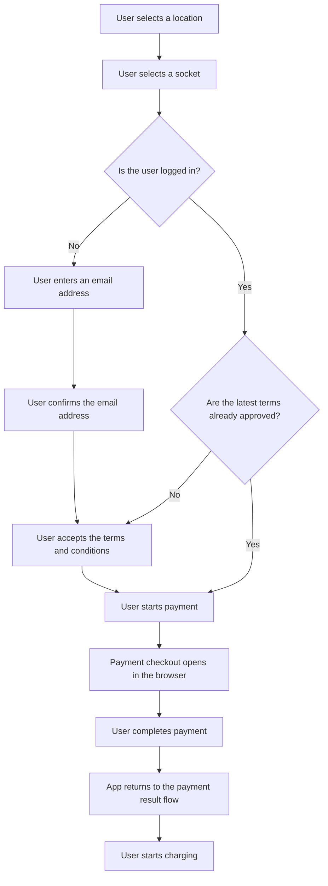

# Boat-charging

## Business rules

1. Users must agree to the terms and conditions before proceeding with boat charging.
2. Logged in users will not be asked to agree to the terms and conditions again if they have already agreed to the latest version of the terms and conditions.

## Start session flow

The start-session flow is coordinated by `useInitSession` in `src/modules/boat-charging/hooks/useInitSession.ts`. The hook acts as a small state machine for the UI: it checks whether the data needed to start a session is present, routes the user to the next required screen when something is missing, and only then calls the backend to initialize the payment flow.

### Flow

This diagram shows the primary user journey. Logged in users may skip the email steps, and logged in users who already accepted the latest terms may skip the terms step.

### Practical implication

The hook does not own the form fields themselves; it owns the orchestration. Individual screens collect one piece of information at a time, store it in Redux, and then call the same hook again. That keeps the branching logic in one place and prevents the start-session flow from diverging between logged in and guest users.
