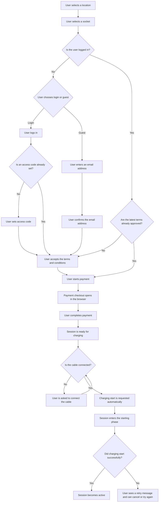

# Boat-charging

## Purpose

Boat charging lets users reserve a socket, complete the required payment and conditions steps, and manage a charging session until it either starts, is cancelled, or is stopped.

## Business rules

1. Users must agree to the terms and conditions before proceeding with boat charging.
2. Logged in users are not asked to accept the terms again when they already approved the latest version.
3. All prices shown to users in the boat-charging flow must be inclusive of VAT, including location rates, start fees, session history amounts, and cost breakdowns.
4. A paid session does not start charging immediately after checkout. Charging starts automatically only after the cable is connected.
5. The session has separate in-progress phases for starting and stopping so the user can see whether the charging point is still processing a command.
6. Cancelling and stopping are different actions. A session that has not started charging yet can still be cancelled, while an active charging session must be stopped.
7. If the start command fails, the session remains recoverable. The user is told to unplug and try again, or to cancel the session instead.

## Start session flow

The start-session flow is coordinated by `useInitSession` in `src/modules/boat-charging/hooks/useInitSession.ts`. The hook acts as a small state machine for the UI: it checks whether the data needed to start a session is present, routes the user to the next required screen when something is missing, and only then calls the backend to initialize the payment flow.

### Flow

This diagram shows the primary user journey. Users who are not logged in can choose between logging in and continuing as a guest. Logged in users who already accepted the latest terms may skip the terms step.

## Session lifecycle after checkout

After payment, the session can move through five user-visible phases:

1. Ready to start: the payment is complete, but the cable still needs to be connected.
2. Starting: the app is waiting for confirmation that the charging point accepted the start request.
3. Charging: charging is active and the session shows energy use, time, and estimated cost.
4. Stopping: the stop request has been sent and the app keeps the charging view visible until the charging point confirms the session is ending.
5. Stopped: the charging point confirmed that charging has ended.

## Stop and recovery rules

1. Before charging starts, the user can cancel the session. This is the way to end a paid session that is still waiting to start or is still in the starting phase.
2. Once charging is active, the user can stop charging. Stopping is confirmed separately and may remain visible as an in-progress state for a short period.
3. If a start attempt fails, the user is instructed to disconnect the cable and retry. The retry path stays available as long as the session is still in the pre-charging state.
