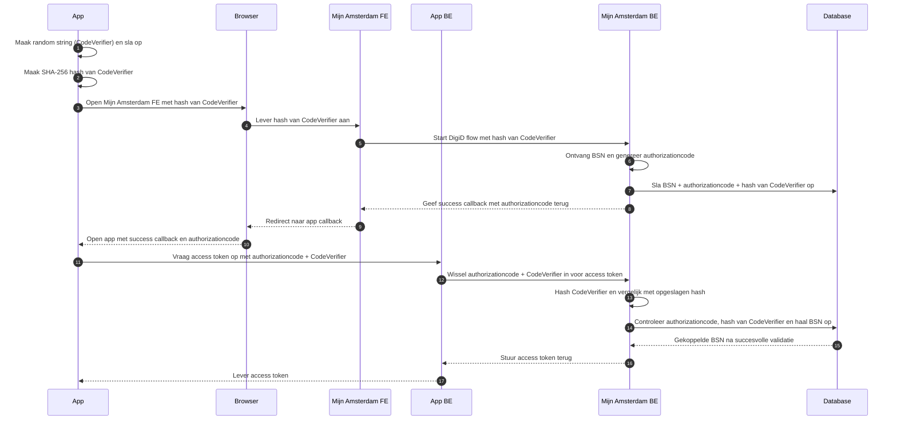

stappen:

1. app maakt een random string (`CodeVerifier`) en slaat deze lokaal op
2. app maakt een SHA-256 hash van de `CodeVerifier` en opent Mijn Amsterdam in de browser met deze hash
3. Mijn Amsterdam FE ontvangt de hash en start de DigiD-flow
4. nadat Mijn Amsterdam BE het BSN van de gebruiker ontvangt, genereert het systeem een `authorizationcode` en slaat deze samen met het BSN en de gehashte `CodeVerifier` op in de database
5. Mijn Amsterdam opent de app opnieuw met een success callback die de `authorizationcode` bevat
6. app vraagt via de App BE een access token op met de combinatie van de `authorizationcode` en de niet-gehashte `CodeVerifier`
7. Mijn Amsterdam hasht de ontvangen `CodeVerifier`, vergelijkt deze met de opgeslagen hash in de database en valideert samen met de `authorizationcode` de aanvraag
8. na succesvolle validatie levert Mijn Amsterdam het access token terug aan de app
