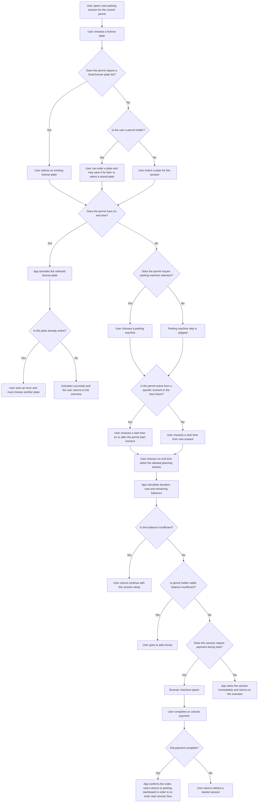

# Parking

## Purpose

Parking lets a user start a parking session with the currently selected permit or visitor account. The flow adapts to the selected permit's rules, such as whether the user must choose a parking machine, whether the session needs start and end times, whether the permit can only use pre-registered license plates, and whether enough time balance or money balance is available.

## Business rules

1. A parking session can only start when there is a current permit. Without one, the flow stops and the user is shown an error state.
2. The start flow always begins with choosing a license plate.
3. When a permit requires a fixed list of license plates, the user can only continue with a plate that already belongs to that permit.
4. When a permit does not require a fixed list, permit holders may enter a new plate during the flow and optionally save it for later use.
5. Visitor-account users enter a plate for the current session only and do not select from the permit holder's stored list.
6. Permits that support zone selection require a parking machine before a session can be started.
7. Permits without an end time do not create a timed session in this flow. They activate the selected license plate directly.
8. Timed permits always require a start time and an end time. The end time must be after the start time.
9. A permit that starts in the future cannot be used before that start moment. The earliest allowed session start time is the permit start moment.
10. The planning window is limited by the permit's maximum session length.
11. When time balance applies, the flow calculates whether enough time remains before submission.
12. When money balance applies for a permit holder, the flow calculates whether enough wallet balance remains before submission.
13. When the remaining time balance is insufficient, the user cannot continue with the current session setup.
14. When the remaining wallet balance is insufficient, the user is redirected to add money before the session can continue.
15. Some parking sessions require payment during session start. In that case the user is sent to a browser checkout and returns to the app afterward.
16. A parking machine outside the permit zone, a missing machine, or an invalid start time keeps the user in the form until the input is corrected.
17. For activation-style permits, selecting the already active license plate is rejected.

## Start session flow

This diagram shows the main start-session path. The code uses permit capabilities and account scope to decide which steps are shown.

## Permit-driven variants

1. Activation permits skip time selection, skip parking cost calculation, and end with license plate activation instead of timed session creation.
2. Zone-based permits require a parking machine. Other permits skip that step.
3. Permits with time balance show remaining time and block submission when the remaining time becomes negative.
4. Permit-holder flows with money balance show remaining wallet balance and require a top-up when the remaining wallet balance becomes negative.
5. Paid visitor flows continue to browser checkout as part of session start.
6. Permits with a future start date clamp the earliest allowed session start to the permit start moment.
7. Permits with a one-day planning window offer a shorter time selection path than permits that allow planning further ahead.

## Outcomes

1. The selected license plate is activated successfully.
2. A timed parking session starts successfully without leaving the app.
3. A paid parking session continues through browser checkout and is confirmed after the user returns to the app.
4. The session cannot start until the user corrects the form, chooses another parking machine or license plate, or adds money.
